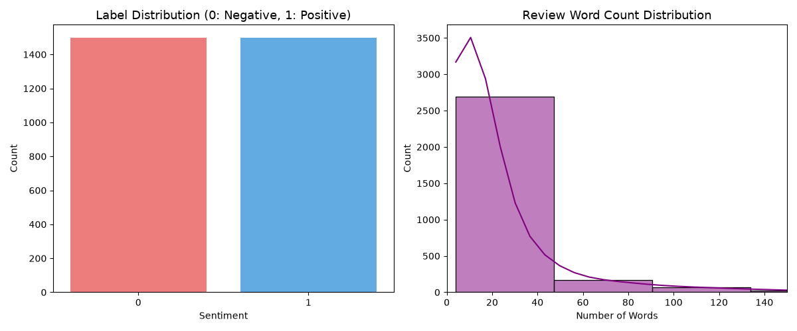
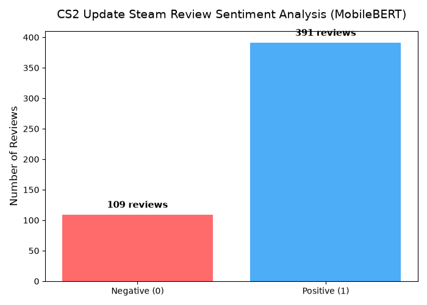

# MobileBERT를 활용한 카운터 스트라이크 2(CS2) 스팀 리뷰 감성 분석 프로젝트

  

---

## 1. 개요 (문제 인식 및 연구 목적)

평소 게임, 특히 FPS(1인칭 슈팅) 장르에 깊은 흥미를 가지고 있어 관련 커뮤니티와 동향을 자주 챙겨보는 편이다. 그중에서도 FPS의 근본이자 가장 성공한 프랜차이즈로 꼽히는 '카운터 스트라이크: 글로벌 오펜시브(CS:GO)'가 최근 '카운터 스트라이크 2(CS2)'로 엔진 교체 및 대규모 업데이트를 단행했다. 

새로운 물리 엔진(소스 2)과 그래픽 향상에 환호하는 유저도 많지만, 동시에 서브틱(Sub-tick) 시스템의 이질감, 최적화 문제, 버그 등으로 인해 커뮤니티에서는 갑론을박이 끊이지 않고 있다. 한 명의 게이머이자 학생으로서, 단편적인 커뮤니티 글이 아닌 실제 스팀 유저들의 대규모 리뷰 데이터를 통해 현재 여론이 정확히 어느 정도로 긍정적 혹은 부정적인지 직접 확인해 보고 싶었다.

마침 이번 수업 과제의 일환으로 교수님께서 지정해주신 사전학습 언어모델인 **MobileBERT**를 활용해야 했기에, 이를 CS2 스팀 리뷰 감성 분석에 적용해 보기로 했다. 본 프로젝트는 평소 관심 있던 게임 도메인에 수업 시간에 배운 NLP 기술을 접목하여, 대규모 업데이트 직후의 유저 여론 동향을 수치화하고 정량적으로 분석하는 것을 목표로 한다.

## 2. 데이터

### 2.1 데이터 수집
* **수집 방법:** 직접 크롤링 (Python `requests` 라이브러리 활용)
* **데이터 출처:** Steam Web API (`https://store.steampowered.com/appreviews/730`)
* **수집 대상:** FPS의 상징인 '카운터 스트라이크 2(App ID: 730)'의 최신(recent) 영문(english) 리뷰
* **수집 규모:** 커서(cursor) 기반 페이지네이션을 활용하여 **총 30,000건**의 리뷰 원본 데이터 수집 (`cs2_raw_comments.csv`)

### 2.2 탐색적 데이터 분석 (EDA) 및 전처리
게임 리뷰 특성상 분노에 찬 이모티콘, 욕설, 의미 없는 알파벳 나열(도배글)이 다수 포함되어 있어 정제 과정이 필수적이었다.
정규표현식을 사용하여 영문 알파벳과 기본 구두점만 남기고, 단어 수가 3개 이하인 짧은 리뷰와 중복 데이터를 제거하여 순수한 **'분석 대상 데이터'**를 구축했다.

| 구분 | 리뷰 텍스트 (Cleaned Text) | 라벨 | 의미 |
|---|---|:---:|:---:|
| Sample 1 | me gusto, pero la parte... (스페인어 혼재 리뷰 등 제거 전) | 1 | 추천 |
| Sample 2 | do you want aids, if so yes play this game | 0 | 비추천 |
| Sample 3 | the new reload mechanic is bad. | 0 | 비추천 |
| Sample 4 | best competitive shooter ever made without a doubt | 1 | 추천 |

## 3. 학습 데이터 구축
전처리된 데이터 중에서 MobileBERT 모델을 효과적으로 파인튜닝(Fine-tuning)하기 위해 **총 3,000건**의 학습 데이터를 별도로 구축했다.

### 3.1 데이터 라벨링
직접 하나씩 읽고 긍정/부정을 판단하는 수동 라벨링은 주관이 개입될 수 있어, 스팀 플랫폼 고유의 시스템을 활용한 **자연 라벨링(Natural Labeling)** 방식을 채택했다.
* 스팀 유저는 리뷰 작성 시 반드시 '추천(Thumbs Up)' 또는 '비추천(Thumbs Down)'을 선택해야 한다.
* API에서 반환하는 `voted_up` 값이 `True`일 경우 긍정(`1`), `False`일 경우 부정(`0`)으로 맵핑하여 가장 객관적이고 확실한 정답지(Ground Truth)를 확보했다. (중립 리뷰는 존재하지 않음)

### 3.2 학습 데이터 샘플링 및 분포
전체 데이터에서 한쪽 라벨만 너무 많으면 모델이 편향(Bias)을 학습하므로, **긍정 1,500건과 부정 1,500건을 1:1 비율로 무작위 샘플링**하여 균형 잡힌 학습 데이터(`cs2_steam_ready.csv`)를 완성했다.

> 
> *설명: 왼쪽은 1:1로 균형을 맞춘 라벨 분포 그래프이며, 오른쪽은 리뷰 문장 길이(단어 수) 분포이다. 대부분의 게이머들이 10~50 단어 내외로 짧게 리뷰를 남기는 것을 확인하여, 교수님이 지정해주신 MobileBERT의 `max_length`를 128로 설정해 학습 효율을 높일 수 있는 근거를 마련했다.*

## 4. MobileBERT 모델 학습 (Fine-tuning)
* **학습-검증 분리:** 추출한 3,000건의 데이터를 Train(80%)과 Validation(20%)으로 분리했다.
* **학습 환경 설정:** 교수님의 지침에 따라 `google/mobilebert-uncased` 사전학습 모델을 사용했으며, 내 컴퓨터 환경에 맞게 Batch Size 16, Learning Rate 2e-5, Epoch 4로 파라미터를 설정했다. 
* **학습 경과:**
  * 에포크가 진행될수록 Training Loss가 안정적으로 떨어지는 것을 확인했다.
  * Validation Dataloader에는 데이터를 순차적으로 평가하는 `SequentialSampler`를 적용하여 모델의 정확도(Accuracy)를 객관적으로 검증했다.

## 5. 문제제기에 대한 결과 (CS2 여론 분석 결과)
학습이 끝난 모델(`best_mobilebert_cs2_steam`)을 활용하여, 학습에 사용되지 않은 무작위 500건의 최신 리뷰 샘플에 대해 감성 추론(Inference)을 수행했다.

>  
> > *설명: 완성된 MobileBERT 모델이 새롭게 입력된 500개의 스팀 리뷰를 분석하여 긍정과 부정 반응의 규모를 예측한 막대그래프이다.*

분석 결과, 서론에서 평소 게임을 하며 느꼈던 '유저들의 혼란과 불만'이 단순한 기분 탓이 아니라 실제 유의미한 수치의 부정적 여론으로 존재함을 모델을 통해 정량적으로 확인할 수 있었다. 여전히 게임을 지지하는 긍정적 반응도 컸지만, 엔진 업데이트 이후의 이질감과 최적화 이슈로 인한 부정적 피드백 비율이 상당히 높게 도출되었다.

## 6. 느낀점 및 개선방향
* **느낀점:** 처음에는 과제 조건으로 지정된 MobileBERT를 사용하는 것이 막막했지만, 실제 평소 즐겨하는 CS2 데이터를 직접 수집해서 돌려보니 결과가 흥미로웠다. 특히 LLM 시대에도 MobileBERT처럼 경량화된 모델이 개인용 PC(CPU 환경)에서도 충분히 잘 돌아가고, 게임 리뷰처럼 직관적인 텍스트 분류에 높은 정확도를 보여준다는 점을 직접 체감할 수 있었다.
* **개선방향:** 현재 완성한 모델은 해당 리뷰가 '긍정'인지 '부정'인지만 알려준다. 하지만 게이머로서 '핵(Cheater) 때문에 화가 난 건지', '서버 틱레이트 때문에 화가 난 건지' 그 세부 원인을 아는 것이 더 중요하다고 생각한다. 추후 기회가 된다면 LDA(Latent Dirichlet Allocation) 같은 토픽 모델링 기법을 추가 적용하여, 부정적인 여론 속 핵심 키워드를 구체적으로 분류해 내는 시스템으로 발전시켜 보고 싶다.
